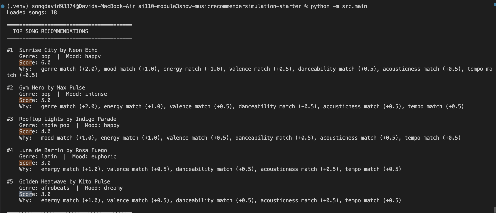

# 🎵 Music Recommender Simulation

## Project Summary THIS IS REALL

In this project you will build and explain a small music recommender system.

Your goal is to:

- Represent songs and a user "taste profile" as data
- Design a scoring rule that turns that data into recommendations
- Evaluate what your system gets right and wrong
- Reflect on how this mirrors real world AI recommenders

Replace this paragraph with your own summary of what your version does.

---

## How The System Works

This recommender is built around the idea of matching a user to a musical vibe, not just finding the most popular songs.

Each Song includes:
- Genre and mood as categorical vibe signals.
- Energy, tempo, acousticness, danceability, and valence as numeric vibe signals.

Each UserProfile stores:
- Preferred genre and mood.
- Target values for key numeric features (especially energy, then tempo and acousticness).

The system uses one scoring formula and one ranking step.

### Finalized Algorithm Recipe

1. For each song, start with a score of 0.
2. Add categorical match points:
  - Mood match: +25 if `song.mood == user.favorite_mood`
  - Genre match: +20 if `song.genre == user.favorite_genre`
3. Add energy closeness (max 30 points):
  - Compute energy similarity with distance-based scoring
  $$s = 1 - \frac{|x - p|}{\text{range}}$$
  where $x$ is song energy and $p$ is target energy.
  - Add $30 \times s$ to the total score.
4. Add acoustic preference points (max 15 points):
  - Reward songs whose acousticness matches whether the user likes acoustic tracks.
5. Add other vibe-signal closeness (max 10 points total):
  - Use tempo, valence, and danceability similarity and combine them into up to 10 points.
6. Repeat for all songs.
7. Sort all songs by total score, highest to lowest.
8. Return top $k$ songs.

### Why These Weights

- Mood is slightly stronger than genre (25 vs 20, about 1.25x) to keep recommendations vibe-first.
- Energy has the biggest numeric weight (30) because it strongly shapes how a song feels in practice.
- Acoustic preference and other numeric signals refine ties and improve personalization.

### Implementation Rules (Final)

- Normalize categorical text before matching: trim spaces and compare in lowercase.
- Use fixed feature ranges for similarity:
  - energy, acousticness, valence, danceability: range = 1.0
  - tempo: range = 200.0 (assuming practical tempo window of 40 to 240 BPM)
- Compute all distance-based similarities as:
  $$s = 1 - \frac{|x - p|}{\text{range}}$$
  then clamp $s$ to $[0, 1]$.
- Split the 10 "other vibe" points as:
  - tempo closeness: 4 points
  - valence closeness: 3 points
  - danceability closeness: 3 points
- Acoustic preference scoring (15 points):
  - If user likes acoustic songs, add $15 \times acousticness$.
  - If user prefers non-acoustic songs, add $15 \times (1 - acousticness)$.
- Clamp final total score to $[0, 100]$.
- Tie-breaking for equal scores:
  1. Higher mood contribution
  2. Higher energy similarity contribution
  3. Lower song id (stable deterministic fallback)
- Edge cases:
  - Empty catalog: return empty list
  - $k \le 0$: return empty list
  - $k > n$: return all $n$ songs sorted
  - Missing or invalid numeric values: skip song or default safely, and document which behavior you choose in code comments
- Explanation format should include:
  - total score 
  - whether mood and genre matched
  - top 2 to 3 strongest contributing features
  - one sentence on why the song ranked where it did

Why this design:
- Scoring tells us how well one song matches the user's vibe.
- Ranking turns many scored songs into a final recommendation list.
- Separating these steps keeps the model simple, explainable, and easy to improve.

Potential bias note:
- This setup may over-reward common moods/genres in the dataset and under-recommend less represented styles.
- Because mood and energy are weighted heavily, songs that are genre-diverse but mood-adjacent may appear more often than niche genre matches.

---

## Getting Started

### Setup

1. Create a virtual environment (optional but recommended):

   ```bash
   python -m venv .venv
   source .venv/bin/activate      # Mac or Linux
   .venv\Scripts\activate         # Windows

2. Install dependencies

```bash
pip install -r requirements.txt
```

3. Run the app:

```bash
python -m src.main
```

### Running Tests

Run the starter tests with:

```bash
pytest
```

You can add more tests in `tests/test_recommender.py`.

---

## Experiments You Tried

Use this section to document the experiments you ran. For example:

- What happened when you changed the weight on genre from 2.0 to 0.5
- What happened when you added tempo or valence to the score
- How did your system behave for different types of users

---

## Limitations and Risks

Summarize some limitations of your recommender.

Examples:

- It only works on a tiny catalog
- It does not understand lyrics or language
- It might over favor one genre or mood

You will go deeper on this in your model card.

---

## Reflection

Read and complete `model_card.md`:

[**Model Card**](model_card.md)

Write 1 to 2 paragraphs here about what you learned:

- about how recommenders turn data into predictions
- about where bias or unfairness could show up in systems like this


---

## 7. `model_card_template.md`

Combines reflection and model card framing from the Module 3 guidance. :contentReference[oaicite:2]{index=2}  

```markdown
# 🎧 Model Card - Music Recommender Simulation

## 1. Model Name

Give your recommender a name, for example:

> VibeFinder 1.0

---

## 2. Intended Use

- What is this system trying to do
- Who is it for

Example:

> This model suggests 3 to 5 songs from a small catalog based on a user's preferred genre, mood, and energy level. It is for classroom exploration only, not for real users.

---

## 3. How It Works (Short Explanation)

Describe your scoring logic in plain language.

- What features of each song does it consider
- What information about the user does it use
- How does it turn those into a number

Try to avoid code in this section, treat it like an explanation to a non programmer.

---

## 4. Data

Describe your dataset.

- How many songs are in `data/songs.csv`
- Did you add or remove any songs
- What kinds of genres or moods are represented
- Whose taste does this data mostly reflect

---

## 5. Strengths

Where does your recommender work well

You can think about:
- Situations where the top results "felt right"
- Particular user profiles it served well
- Simplicity or transparency benefits

---

## 6. Limitations and Bias

Where does your recommender struggle

Some prompts:
- Does it ignore some genres or moods
- Does it treat all users as if they have the same taste shape
- Is it biased toward high energy or one genre by default
- How could this be unfair if used in a real product

---

## 7. Evaluation

How did you check your system

Examples:
- You tried multiple user profiles and wrote down whether the results matched your expectations
- You compared your simulation to what a real app like Spotify or YouTube tends to recommend
- You wrote tests for your scoring logic

You do not need a numeric metric, but if you used one, explain what it measures.

---

## 8. Future Work

If you had more time, how would you improve this recommender

Examples:

- Add support for multiple users and "group vibe" recommendations
- Balance diversity of songs instead of always picking the closest match
- Use more features, like tempo ranges or lyric themes

---

## 9. Personal Reflection

A few sentences about what you learned:

- What surprised you about how your system behaved
- How did building this change how you think about real music recommenders
- Where do you think human judgment still matters, even if the model seems "smart"


## !! SCREENSHOT!!
